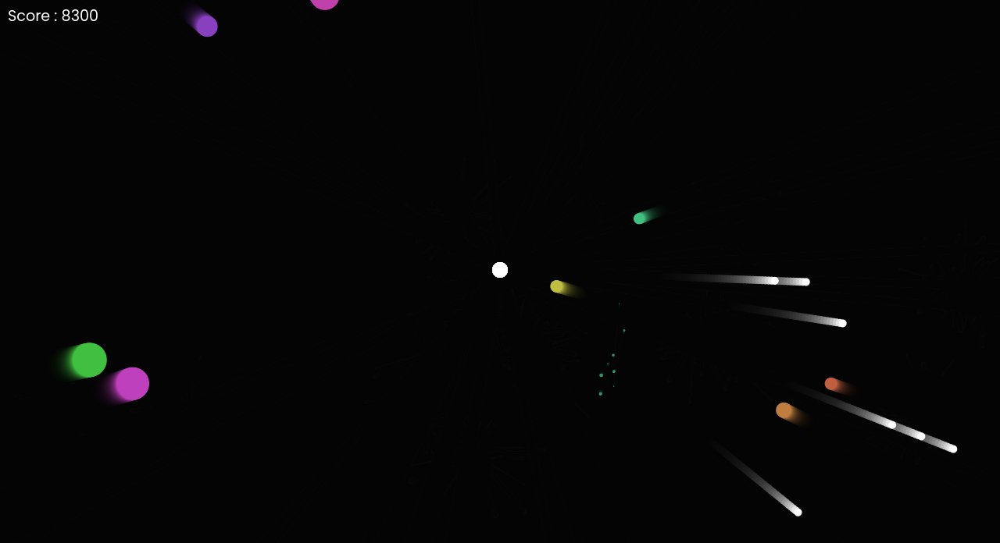

# Shooting Game

A shooting game built using javascript and HTML5 canvas.
[Live Demo](https://shootit.netlify.app/)



## How to run on your machine


- Open your are terminal.
- Clone the repo.

```bash
   git clone https://github.com/asyncnavi/shooting-game.git
```
- OR Simply download zip file from github website.
- go to directory 

You can use VSCode Live server extension or gserve or can simply run index.html in the browser.

### Thanks Happy Coding 💝.
